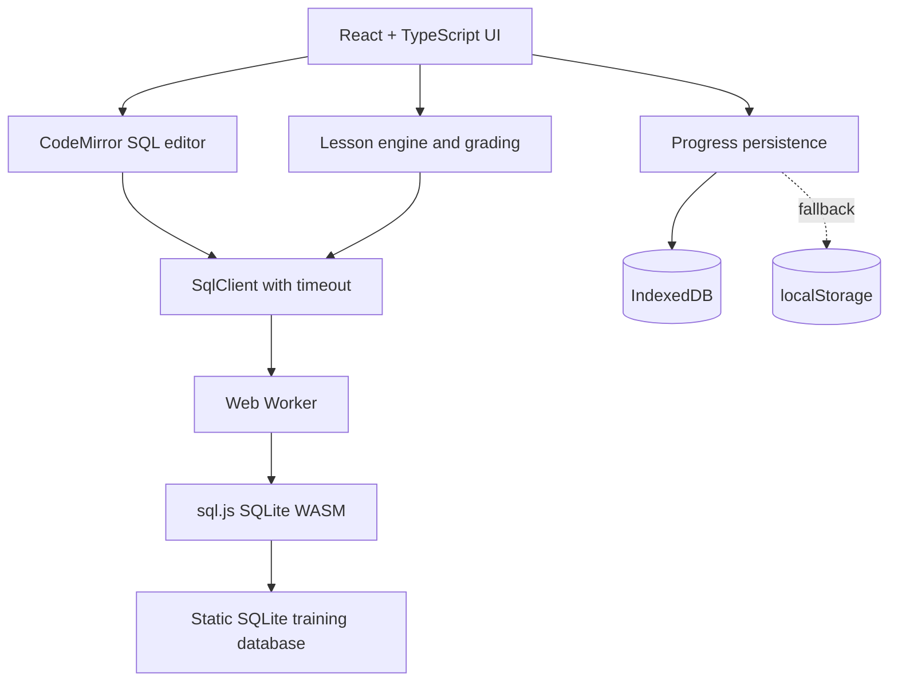

# Technical architecture

## Diagram

## Component responsibilities

- `src/App.tsx`: landing page, navigation, lesson display, editor, feedback, schema and results.
- `content/chapter-01.json`: narrative and grading reference queries.
- `src/worker/sql.worker.ts`: loads database, prepares SELECT statements, iterates capped result rows, returns errors.
- `src/lib/sqlClient.ts`: worker lifecycle, message correlation, timeout, reinitialization.
- `src/lib/sqlEngine.ts`: single-statement execution, read-only database initialization, schema and capped results.
- `src/lib/types.ts`: lesson, SQL result and worker protocol types.
- `src/lib/grading.ts`: compare complete query results regardless of valid SQL phrasing, preserving multiplicity and optional order.
- `src/lib/progress.ts`: save current lesson, completion and drafts using IndexedDB with fallback.
- `scripts/build-sample-db.py`: generates the instructional SQLite database from the committed fictional CSV source.

## Data flow

1. App initializes worker and asks it to download the SQLite file from Vite's base URL.
2. Worker loads sql.js WASM, opens the database from bytes, activates `PRAGMA query_only=ON`.
3. UI sends SQL to SqlClient, which posts an event with a numeric request ID.
4. Worker validates read-only query prefix, executes using a prepared statement, captures up to 100 rows.
5. SqlClient resolves matching request; UI shows data or readable SQL error.
6. Check Answer executes the learner query and chapter reference query, compares returned column sets, multiplicity and values.
7. Completed lessons, selected mission and distinct drafts are stored in browser IndexedDB, with a synchronous localStorage mirror for immediate reloads. On load, the newest valid snapshot wins. Original starter progress is migrated. If both stores fail, the app warns the learner and continues in memory.

## SQLite guardrails

- `PRAGMA query_only=ON` rejects write operations at the SQLite layer.
- Leading SQL comments are accepted before SELECT/WITH. PRAGMA, attachment commands and multiple statements are rejected before execution. SQLite query_only remains the write guard; the prefix check alone is not a security boundary.
- A timeout terminates the entire worker, preventing a long computation from locking the UI indefinitely.
- Prepared statements collect at most 100 rows, stepping once more to distinguish exactly 100 rows from a truncated result. Anything truncated cannot be graded correct. Statements are always freed.
- A later chapter teaching writes should get its own disposable database copy.

## Security and privacy

No backend, authentication, or API key. All SQL and grading are local in the learner's browser. Static exercise reference queries are visible in shipped client data and deliberately not anti-cheat protected. Never add an LLM API secret to frontend code. Device progress is local and will not automatically sync across devices.

## Build and deployment

Vite `base` is `/` in development and `/titanic-data-academy/` under GitHub Pages. The Actions workflow sets `GITHUB_PAGES=true` before build. `sql.js` WASM is emitted as a build asset. The `.sqlite` database is copied from `public/data/`. The workflow uses npm ci with the committed lockfile, verifies database integrity and CSV parity, runs SQL/grading/persistence/worker tests and TypeScript checking, and builds for the Pages base path. Chromium browser tests run against the production preview before uploading the deployment artifact.

## Future refactoring

After Chapter 2 consider splitting `App.tsx` into reusable `StoryPanel`, `MissionPanel`, `SqlWorkspace`, `ResultsGrid`, `SchemaExplorer`, and `ChapterNavigation` components. For MVP one screen is easier to iterate; logic-heavy subsystems are already isolated.
